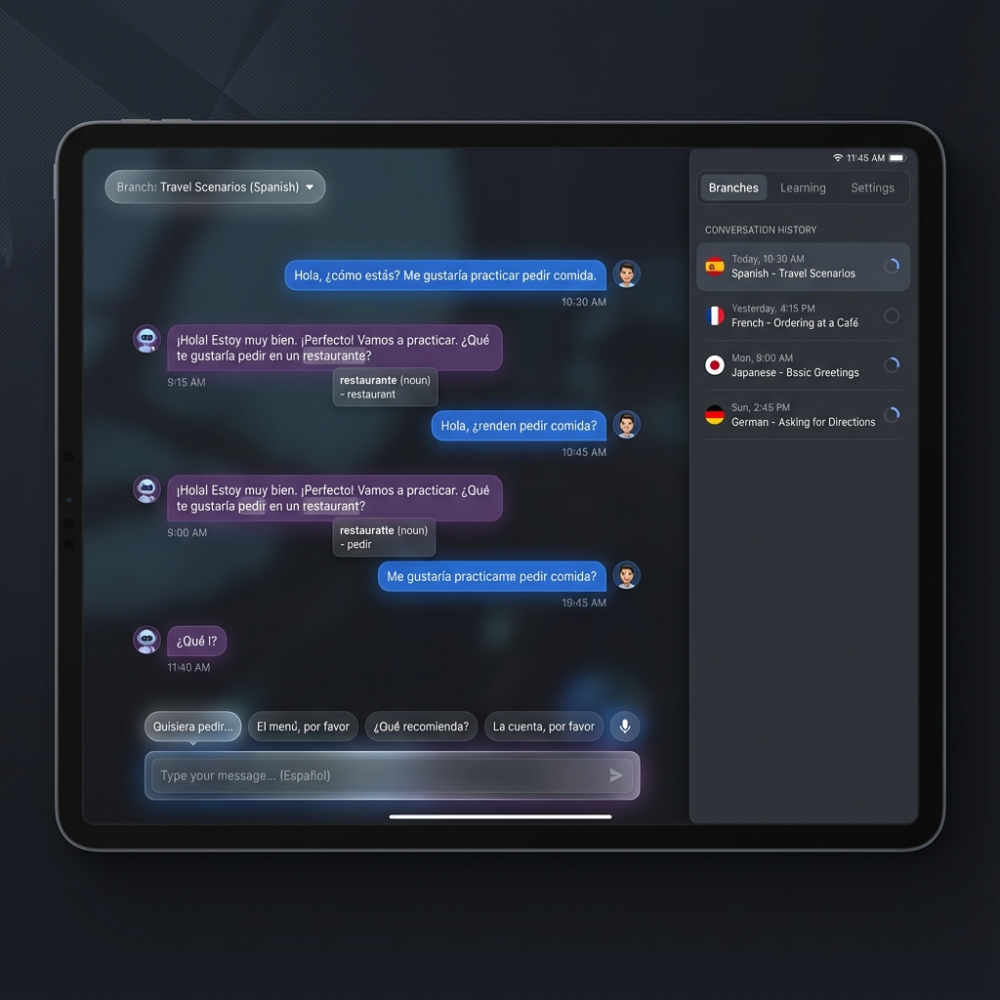
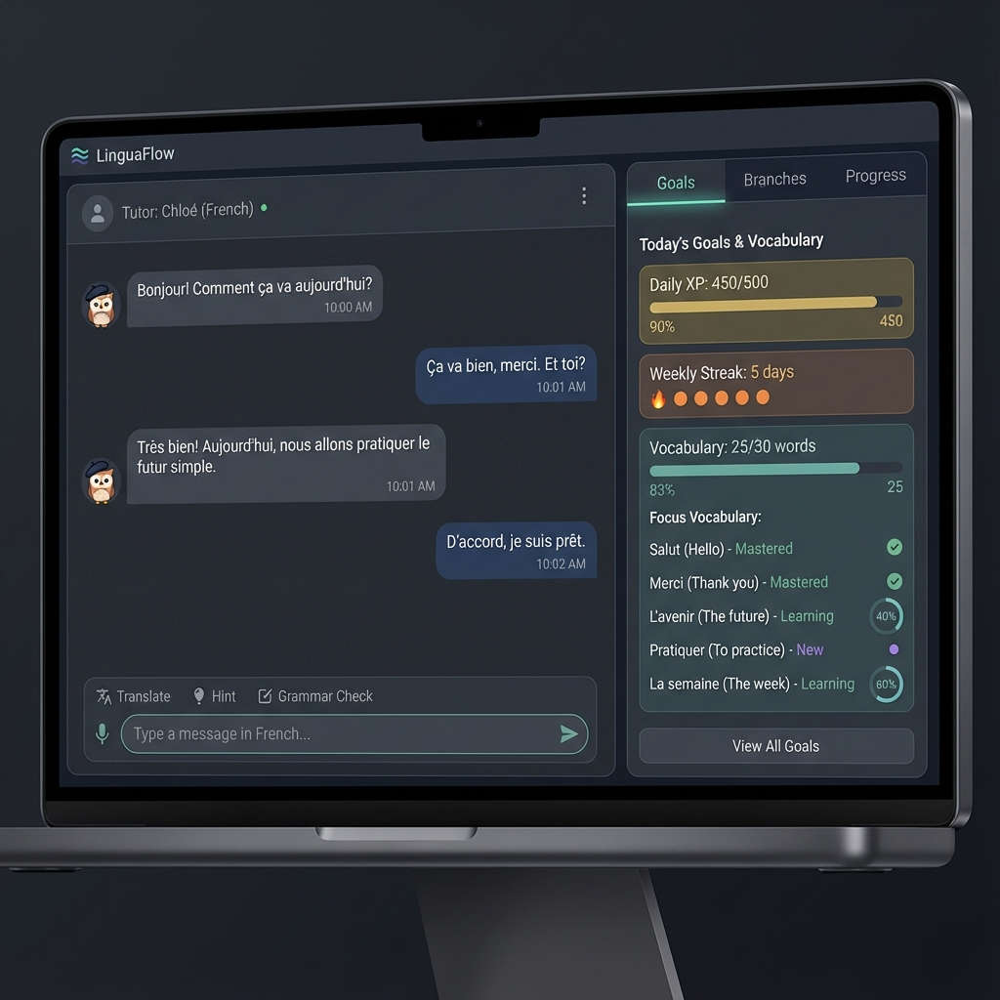
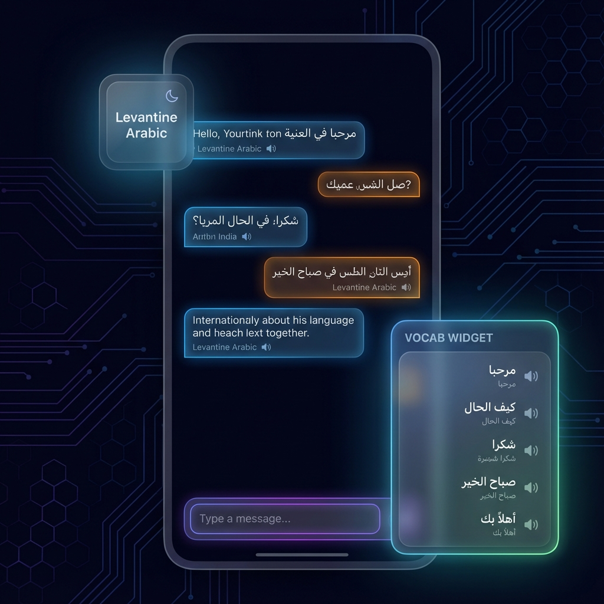

# Complete UI Redesign Plan

**Goal:** COMPLETELY REDESIGN THE UI to a "Hybrid Dashboard" layout that consolidates management tools into a unified right sidebar and places critical learning context directly on the chat canvas via floating HUD elements.

## Code Style & Standards
All code written in this plan must adhere to:
*   **Module Size:** Modules must be < 200 lines.
*   **Function Size:** Functions must be < 20 lines.
*   **Architecture:** Use pure functions and stateless architectures where possible.
*   **Naming:** snake_case for modules/functions, UpperCamelCase for types.

## Phase 1: Foundation & Utility Sidebar
**Goal:** Establish the new layout shell and implement the Unified Right Sidebar structure.

### Subphase 1.1: Layout Shell Refactoring
*   **Action Items:**
    *   Update `index.css` to remove the left split-pane layout.
    *   Implement a new Grid/Flex layout: `[ Chat Canvas (auto) | Utility Panel (fixed width) ]`.
    *   Modify `MainContent.rs` to support this new structure.
*   **Files:**
    *   [MODIFY] `src/styles/index.css`
    *   [MODIFY] `src/components/main_content.rs`

### Subphase 1.2: Utility Sidebar Component
*   **Action Items:**
    *   Create `UtilitySidebar` component that manages which tab is active (Branches, Learning, Settings).
    *   This component will act as a container/coordinator only.
*   **Files:**
    *   [NEW] `src/components/utility_sidebar/mod.rs` (Coordinator)

### Subphase 1.3: Porting Sidebar Content
*   **Action Items:**
    *   Break down `BranchSidebar.rs` (currently 295 lines) into smaller components within `utility_sidebar/branches/`.
    *   Break down `LearningPanel.rs` (currently 983 lines) into smaller components within `utility_sidebar/learning/`.
    *   Move `SettingsPanel` content into `utility_sidebar/settings/`.
*   **Files:**
    - [x] Create `frontend/src/components/utility_sidebar/branches.rs`.
    - [x] Move content from `BranchSidebar.rs` (legacy) to `branches.rs`.
    - [x] Integrate into `utility_sidebar/mod.rs` (Branches tab).
    - [x] Create `frontend/src/components/utility_sidebar/learning.rs`.
    - [x] Move content from `LearningPanel.rs` (legacy) to `learning.rs`.
    - [x] Integrate into `utility_sidebar/mod.rs` (Learning tab).
    - [x] Create `frontend/src/components/utility_sidebar/settings.rs`.
    - [x] Move content from `SettingsPanel.rs` (legacy) to `settings.rs`.
    - [x] Integrate into `utility_sidebar/mod.rs` (Settings tab).
    - [x] Verify compilation and pass `cargo clippy`. --all` until clean.

**Verification:**
> Run `cargo test --all` and `cargo clippy --all` until clean.

## Phase 2: Floating HUD & Canvas Elements
**Goal:** Implement the immersive floating elements on the chat canvas.

### Subphase 2.1: Input Area Redesign
*   **Action Items:**
    - [x] Update `InputBox` CSS to float above the bottom edge.
    - [x] Ensure it has z-index to sit above the chat scroll area if needed.
*   **Files:**
    - [x] `src/components/input_box.rs` (styled via CSS)
    - [x] `src/styles/components/composer.css`

### Subphase 2.2: Vocabulary HUD
*   **Action Items:**
    - [x] Create `VocabHud` component.
    - [x] Logic: Fetch "Still Learning" items and display them as horizontal chips.
    - [x] Position: Absolute/fixed positioning relative to the InputBox.
*   **Files:**
    - [x] `src/components/vocab_hud.rs`

### Subphase 2.3: Branch Switcher Pill
*   **Action Items:**
    - [x] Create `BranchSwitcherPill` for the top-left corner.
    - [x] Logic: Show current branch name. Click to open the specific "Branches" tab in the Utility Sidebar.
*   **Files:**
    - [x] `src/components/branch_switcher_pill.rs`

**Verification:**
> Run `cargo test --all` and `cargo clippy --all` until clean.

## Phase 3: Cleanup & Polish
**Goal:** Remove legacy code and finalize the high-end aesthetic.

### Subphase 3.1: Legacy Removal
*   **Action Items:**
    *   Delete `src/components/branch_sidebar.rs`.
    *   Delete `src/components/learning_panel.rs`.
    *   Delete `src/components/settings_panel.rs`.
*   **Files:**
    *   [DELETE] `src/components/branch_sidebar.rs`
    *   [DELETE] `src/components/learning_panel.rs`
    *   [DELETE] `src/components/settings_panel.rs`

### Subphase 3.2: Visual Polish
*   **Action Items:**
    *   Apply glassmorphism effects (backdrop-filter: blur) to the HUD and Pill.
    *   Add transition animations for the Sidebar collapsing/expanding.
*   **Files:**
    *   [MODIFY] `src/styles/index.css`

**Verification:**
> Run `cargo test --all` and `cargo clippy --all` until clean.

## UI Reference
### The Goal: Hybrid Layout

### Component Reference: Unified Sidebar

### Component Reference: Floating HUD

